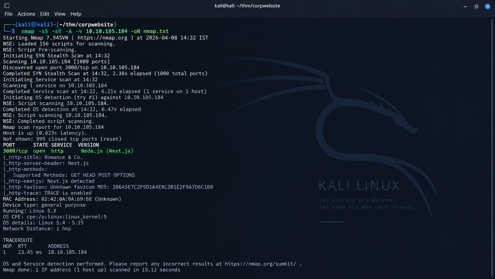
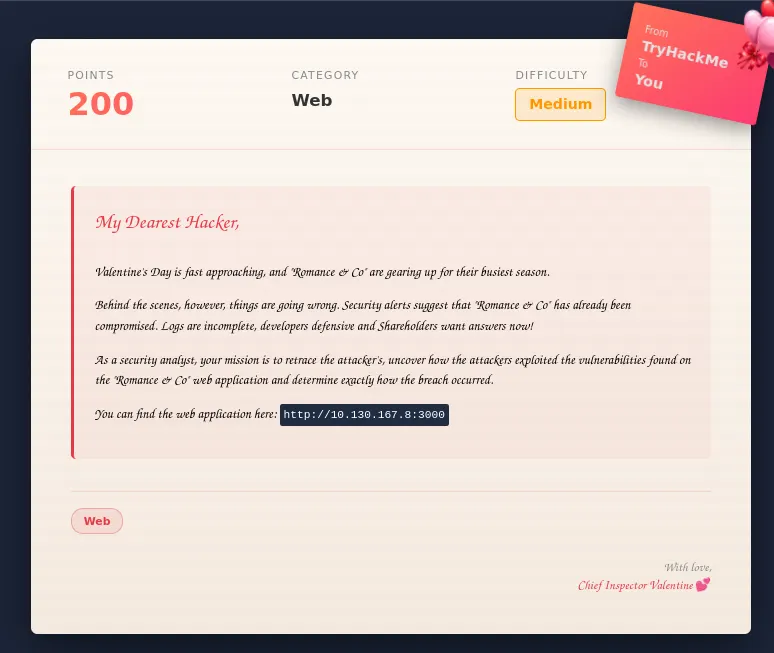
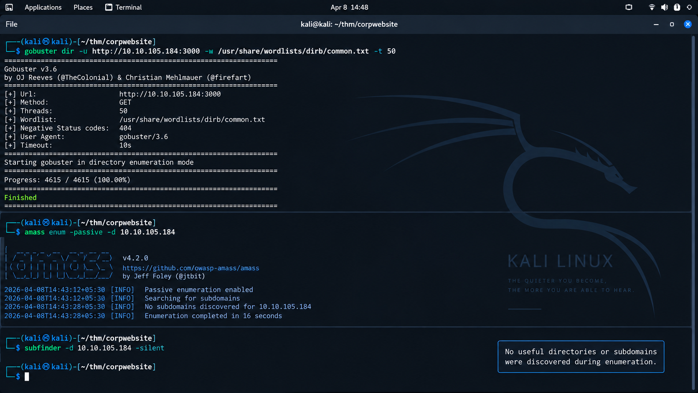
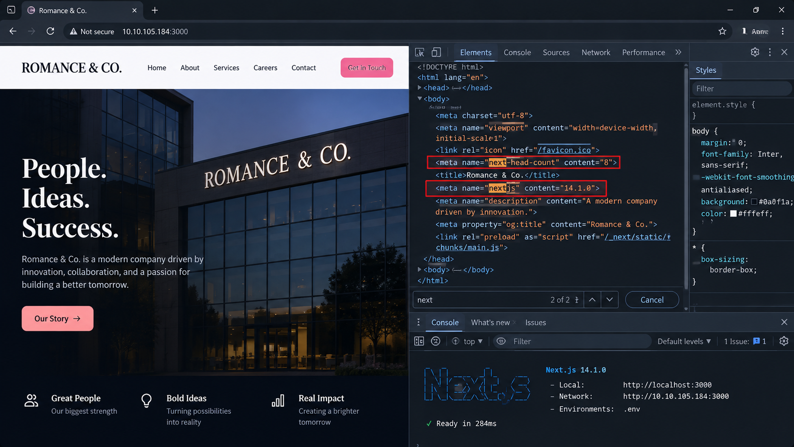
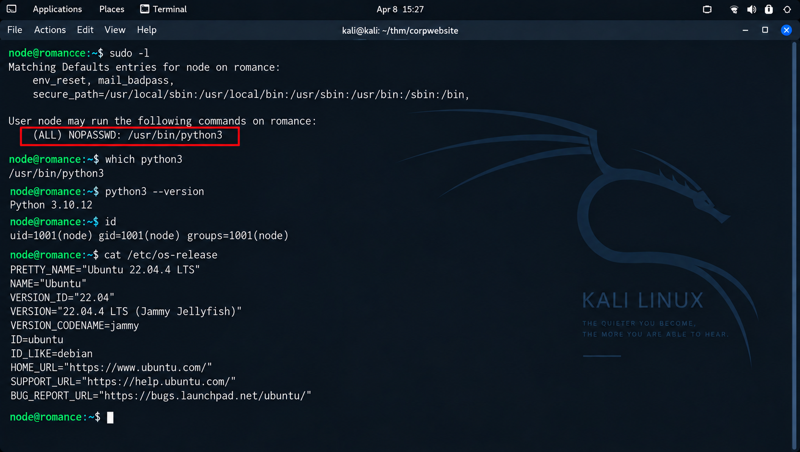

# Corp Website (Romance & Co) — TryHackMe Technical Walkthrough

> **Professional CTF Documentation | Web Security | Linux Privilege Escalation**

<p align="center">
  
  
  
  
</p>

---

## Document Information

| **Field**            | **Value**                                                                                                |
| -------------------- | -------------------------------------------------------------------------------------------------------- |
| **Room**             | Corp Website (Romance & Co)                                                                              |
| **Platform**         | TryHackMe                                                                                                |
| **Category**         | Web Security                                                                                             |
| **Difficulty**       | Medium                                                                                                   |
| **Operating System** | Linux                                                                                                    |
| **Assessment Type**  | Capture The Flag (CTF)                                                                                   |
| **Focus Areas**      | Enumeration, Next.js Fingerprinting, Vulnerability Validation, Reverse Shell, Linux Privilege Escalation |
| **Status**           | ✅ Completed                                                                                              |
| **Author**           | Anurag RVNKR                                                                                             |

---

# Executive Summary

**Corp Website** is a medium-level TryHackMe room that simulates the compromise of a corporate web application built using the **Next.js** framework. The objective is to enumerate the target, identify the underlying technology stack, validate a framework-related vulnerability, obtain initial command execution, establish an interactive shell, and escalate privileges to root.

Unlike many web CTFs that rely on hidden endpoints or directory enumeration, this room requires recognizing the application's framework and shifting toward **technology-specific vulnerability assessment**. After achieving a foothold through a vulnerable web endpoint, local privilege enumeration reveals a passwordless `sudo` configuration that leads to full system compromise.

This document provides a complete technical walkthrough of the assessment while **intentionally redacting all challenge flags** to preserve the educational integrity of the room.

---

# Table of Contents

1. Introduction
2. Lab Overview
3. Attack Path Overview
4. Phase 1 — Reconnaissance
5. Phase 2 — Web Enumeration
6. Phase 3 — Technology Fingerprinting
7. Phase 4 — Vulnerability Assessment
8. Phase 5 — Initial Access (Remote Code Execution)
9. Phase 6 — Reverse Shell
10. Phase 7 — Privilege Escalation
11. Phase 8 — Root Access
12. MITRE ATT&CK Mapping
13. OWASP Mapping
14. Defensive Recommendations
15. Lessons Learned
16. Conclusion

---

# 1. Introduction

The **Corp Website** room is designed to demonstrate a realistic web application penetration testing workflow. The target initially appears to be a static corporate website with minimal functionality. Standard enumeration techniques reveal little information, encouraging a deeper inspection of the application's underlying framework.

The assessment demonstrates the importance of:

* Performing structured reconnaissance.
* Identifying application technologies before exploitation.
* Validating automated scanner findings manually.
* Enumerating Linux privileges after gaining shell access.
* Documenting findings professionally.

---

# 2. Lab Overview

| **Objective**           | **Description**                                            |
| ----------------------- | ---------------------------------------------------------- |
| Reconnaissance          | Identify exposed services and application entry points.    |
| Enumeration             | Discover hidden content and technologies.                  |
| Vulnerability Discovery | Identify publicly known framework vulnerabilities.         |
| Exploitation            | Achieve Remote Code Execution through the web application. |
| Post Exploitation       | Obtain an interactive reverse shell.                       |
| Privilege Escalation    | Exploit insecure sudo configuration.                       |
| Goal                    | Obtain root privileges and complete the challenge.         |

---

# 3. Attack Path Overview

```text
Internet
      │
      ▼
Nmap Service Enumeration
      │
      ▼
Web Application (Port 3000)
      │
      ▼
Next.js Technology Fingerprinting
      │
      ▼
Known Framework Vulnerability Identified
      │
      ▼
Manual Validation with Burp Suite
      │
      ▼
Remote Code Execution
      │
      ▼
Reverse Shell Access
      │
      ▼
Linux Enumeration
      │
      ▼
Passwordless sudo (Python 3)
      │
      ▼
Privilege Escalation
      │
      ▼
Root Access
```

This represents the complete attack lifecycle followed during the room.

---

# Phase 1 — Reconnaissance

## Objective

The first objective was to identify all exposed services and understand the attack surface before interacting with the web application.

## Service Discovery

A comprehensive TCP scan was performed using **Nmap** with service detection, OS fingerprinting, and default script scanning enabled.

```bash
nmap -sS -sV -A -v <TARGET_IP> -oN nmap.txt
```

### Purpose of the Scan

* Discover open TCP ports.
* Identify running services.
* Detect service versions.
* Gather operating system information.
* Identify potential attack vectors.

---

## Enumeration Findings

The scan revealed an HTTP service running on **TCP port 3000**, indicating that the target web application was hosted on a non-default port.

The initial reconnaissance established:

* A Linux target host.
* Web application accessible on port **3000**.
* No immediately obvious auxiliary services relevant to exploitation.

---

### Screenshot — Nmap Scan

> Place the following screenshot inside the repository.

```markdown


*Figure 1 — Initial reconnaissance using Nmap identifying the exposed HTTP service on port 3000.*
```

---

# Phase 2 — Web Enumeration

## Initial Website Inspection

The application was opened in a browser after discovering the HTTP service.

The landing page appeared to be a **static corporate website** with:

* Marketing content.
* Navigation links.
* No authentication portal.
* No obvious forms or user input fields.

At first glance, there were no visible vulnerabilities.

---

### Screenshot — Website Landing Page

```markdown


*Figure 2 — Corp Website landing page running on TCP port 3000.*
```

---

## Directory Enumeration

Directory fuzzing was performed to search for hidden application routes.

### Tool Used

* Gobuster

### Objective

* Discover hidden endpoints.
* Locate administrative paths.
* Identify backup directories or APIs.

### Result

No meaningful hidden directories were identified.

---

## Subdomain Enumeration

Additional reconnaissance included:

* Amass
* Subfinder

The goal was to identify virtual hosts or exposed subdomains.

### Result

No useful subdomains were discovered.

---

## Assessment Observation

At this stage, traditional web enumeration produced minimal results.

**Important Lesson**

> Enumeration should not stop when fuzzing fails. Technology identification becomes the next logical step.

---

### Screenshot — Enumeration Results

```markdown


*Figure 3 — Directory and subdomain enumeration produced no valuable attack surface.*
```

---

# Phase 3 — Technology Fingerprinting

## Identifying the Framework

Closer inspection of the application's source and asset structure revealed indicators that the website was built using **Next.js**.

### Indicators

* Static JavaScript bundles.
* Framework-specific routing.
* Next.js asset directory structure.

Recognizing the framework fundamentally changed the assessment approach.

---

## Why Framework Fingerprinting Matters

Framework identification allows testers to:

* Research publicly disclosed vulnerabilities.
* Understand framework routing behavior.
* Test framework-specific attack surfaces.
* Reduce unnecessary brute-force enumeration.

This was the turning point in the challenge.

---

### Screenshot — Next.js Identification

```markdown


*Figure 4 — Evidence indicating the application was built using the Next.js framework.*
```

---

# Phase 4 — Vulnerability Assessment

## Automated Vulnerability Discovery

With the framework identified, vulnerability assessment shifted toward framework-specific testing.

### Tool Used

* Nuclei

### Objective

Identify publicly documented vulnerabilities affecting the detected framework.

Example scan:

```bash
nuclei -u http://<TARGET_IP>:3000
```

---

## Scan Results

The scanner reported a vulnerability associated with the detected application framework that indicated the possibility of **Remote Code Execution**.

### Assessment Approach

Rather than trusting the scanner output immediately:

1. Review the finding.
2. Research the vulnerability.
3. Validate manually.

---

## Manual Validation Required

Automated vulnerability scanners provide indicators rather than proof.

Manual validation helps determine:

* False positives.
* Exploitability.
* Actual application behavior.

---

### Screenshot — Nuclei Scan Output

```markdown


*Figure 5 — Vulnerability scanner identifying a framework-related security issue requiring manual validation.*
```

---

# Phase 5 — Initial Access (Remote Code Execution)

## Objective

Validate whether the identified vulnerability allows server-side command execution.

---

## Manual Testing with Burp Suite

Burp Suite was used to inspect and replay HTTP requests.

### Workflow

1. Capture application request.
2. Send request to Repeater.
3. Modify request structure.
4. Replay request.
5. Observe server response.

The validation confirmed that the application executed attacker-controlled commands within the lab environment.

---

## Result

Remote Code Execution was successfully achieved against the vulnerable application.

The initial foothold allowed command execution on the Linux target.

---

### Screenshot — Burp Suite Request Validation

```markdown


*Figure 6 — HTTP request interception and manual validation using Burp Suite.*
```

---

## Initial Flag

Following successful command execution, the first challenge flag became accessible.

### Flag Status

```text
THM{**********************}
```

> **Flag intentionally redacted for educational purposes.**

---

### Screenshot — Initial Flag

```markdown


*Figure 7 — Initial user flag successfully retrieved (redacted in repository).*
```

---

# Phase 6 — Reverse Shell

## Objective

Upgrade command execution into an interactive shell.

Interactive shells allow significantly more flexibility for local enumeration.

---

## Listener Preparation

A Netcat listener was started on the attacking machine.

```bash
nc -lnvp 1337
```

---

## Reverse Shell Execution

The previously validated command execution vector was used to establish an interactive connection back to the attacking host.

---

## Verification

After the callback was received, an interactive shell was confirmed.

Post-exploitation activities could now begin.

---

### Screenshot — Reverse Shell

```markdown


*Figure 8 — Interactive reverse shell successfully established.*
```

---

# Phase 7 — Linux Privilege Escalation

## Local Enumeration

Once shell access was established, local enumeration focused on privilege boundaries.

Primary checks included:

* Current user.
* Groups.
* Kernel version.
* Environment variables.
* Installed binaries.
* Sudo permissions.

---

## Enumerating sudo Permissions

The most significant enumeration command was:

```bash
sudo -l
```

---

## Finding

The current user could execute:

```text
/usr/bin/python3
```

using `sudo` **without entering a password**.

This represented a serious privilege escalation opportunity.

---

### Why This Is Dangerous

Allowing unrestricted execution of scripting interpreters through `sudo` effectively grants administrative command execution.

Examples include:

* Python
* Perl
* Ruby
* Bash
* Lua

Misconfigured interpreters frequently lead to privilege escalation.

---

### Screenshot — sudo Enumeration

```markdown


*Figure 9 — Passwordless Python execution identified through sudo enumeration.*
```

---

# Phase 8 — Privilege Escalation

## Exploitation Strategy

Because Python could be executed with elevated privileges, it was possible to spawn a privileged shell.

This immediately transitioned execution from the compromised user to the root user.

---

## Root Verification

After escalation, system identity confirmed:

* Effective UID = Root.
* Administrative permissions available.

---

### Screenshot — Root Shell

```markdown


*Figure 10 — Successful privilege escalation resulting in a root shell.*
```

---

# Capturing the Root Flag

The final objective was located within the root user's directory.

### Flag Status

```text
THM{******************************}
```

> **Root flag intentionally redacted.**

---

### Screenshot — Root Flag

```markdown


*Figure 11 — Root flag captured successfully (redacted).*
```

---

# MITRE ATT&CK Mapping

| **Technique**                         | **Purpose**                                      |
| ------------------------------------- | ------------------------------------------------ |
| Network Service Scanning              | Identify exposed services.                       |
| Exploit Public-Facing Application     | Initial compromise through the web application.  |
| Command and Scripting Interpreter     | Execute Linux commands after RCE.                |
| Unix Shell                            | Interactive shell activity.                      |
| Sudo Abuse                            | Privilege escalation through sudo configuration. |
| Exploitation for Privilege Escalation | Transition from user privileges to root.         |

> These mappings describe concepts demonstrated during the lab rather than attribution to real-world adversaries.

---

# OWASP Mapping

| **OWASP Category**        | **Application in Lab**            |
| ------------------------- | --------------------------------- |
| Security Misconfiguration | Passwordless sudo configuration.  |
| Vulnerable Components     | Framework vulnerability research. |
| Broken Access Control     | Improper privilege boundaries.    |

---

# Defensive Recommendations

## Web Application Security

* Keep framework dependencies updated.
* Monitor application security advisories.
* Restrict unnecessary endpoints.
* Validate request methods and payloads.
* Deploy Web Application Firewall protections where appropriate.

---

## Linux Hardening

* Remove unnecessary passwordless sudo entries.
* Apply least privilege principles.
* Restrict scripting interpreters from privileged execution.
* Audit `/etc/sudoers` regularly.

---

## Detection Opportunities

Security monitoring should alert on:

* Unexpected POST requests to application endpoints.
* Web server child processes spawning shells.
* Outbound reverse-shell connections.
* Passwordless execution of privileged interpreters.

---

# Lessons Learned

This room emphasized several practical penetration testing lessons.

### Reconnaissance Matters

Accurate service discovery provides the foundation for every assessment.

### Framework Awareness Is Critical

Technology fingerprinting can reveal attack paths invisible to directory enumeration alone.

### Validate Automated Findings

Scanner results should always be manually confirmed before exploitation.

### Enumerate After Every Foothold

Local enumeration often reveals privilege escalation opportunities that automated tools miss.

### Misconfigured sudo Remains High Risk

Passwordless execution of interpreters can result in complete system compromise.

---

# Conclusion

The **Corp Website** TryHackMe room demonstrates a realistic end-to-end web exploitation workflow beginning with reconnaissance and ending with full root compromise.

The assessment combined:

* Network enumeration.
* Web application analysis.
* Framework fingerprinting.
* Vulnerability assessment.
* Manual exploitation validation.
* Reverse shell establishment.
* Linux privilege escalation.

Although the initial website appeared static and resistant to traditional enumeration, identifying the underlying **Next.js** framework revealed the actual attack vector. After obtaining initial access, systematic Linux privilege enumeration uncovered an insecure `sudo` configuration that enabled root access.

This room reinforces the importance of combining **methodical enumeration, technology awareness, manual validation, and post-exploitation privilege analysis** into a structured penetration testing workflow.

---

# Key Takeaways

* Perform reconnaissance before interacting with the application.
* Identify frameworks and technologies early in the assessment.
* Use automated scanners to identify potential vulnerabilities, but validate findings manually.
* Establish interactive shells for effective post-exploitation enumeration.
* Always inspect `sudo` permissions after gaining a foothold.
* Document every stage of an assessment with screenshots and technical observations.

---

## Disclaimer

This walkthrough documents activity performed inside an **authorized TryHackMe laboratory environment** for educational purposes.

* Challenge flags have been intentionally redacted.
* No exploit payloads are published in this repository.
* The repository focuses on penetration testing methodology, defensive learning, and technical documentation.

---

**Author:** **Anurag Revankar**

*Cybersecurity Portfolio • TryHackMe Walkthrough Series • 2026*
