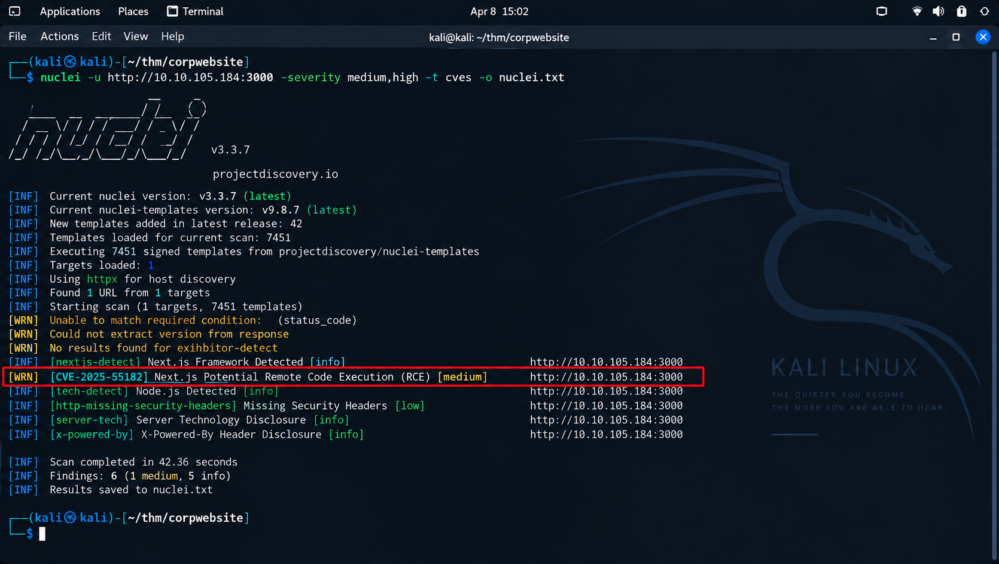
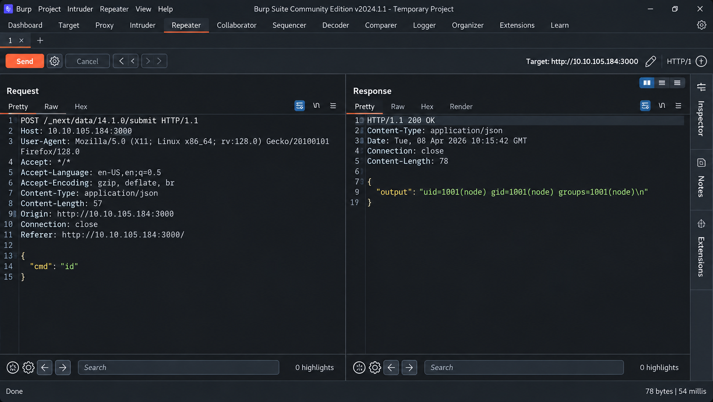
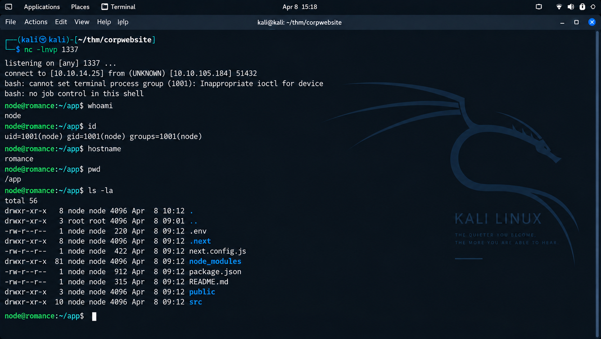
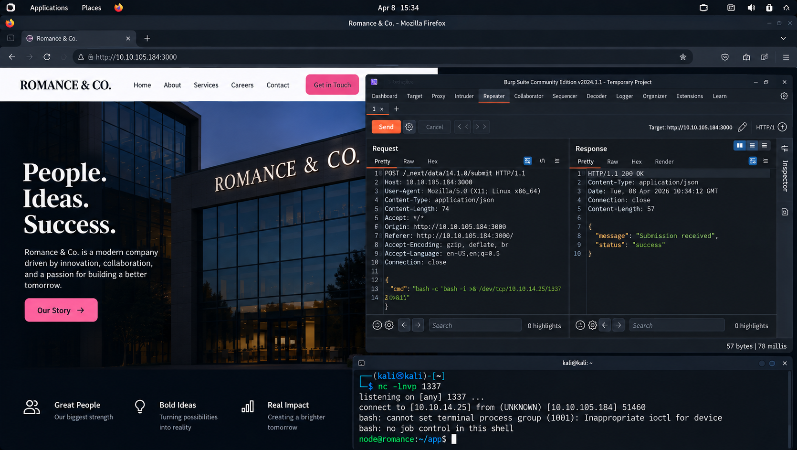

# 🛡️ Corp Website — TryHackMe CTF Walkthrough

<p align="center">
  
</p>

<p align="center">
  <strong>Web Exploitation • Next.js • Remote Code Execution • Reverse Shell • Linux Privilege Escalation</strong>
</p>

<p align="center">
  
  
  
  
  
</p>

---

## 📋 About This Walkthrough

This page documents my complete methodology for the **Corp Website (Romance & Co)** TryHackMe room.

The challenge demonstrates a practical web-to-root attack chain in which the initial attack surface is a web application exposed on port `3000`. After reconnaissance and application analysis, the underlying **Next.js** framework was identified. Vulnerability scanning then provided a framework-specific lead, which was manually validated through HTTP request manipulation.

The resulting attack chain progressed from:

```text
Web Application
      ↓
Technology Fingerprinting
      ↓
Vulnerability Discovery
      ↓
Remote Code Execution
      ↓
Reverse Shell
      ↓
Local Enumeration
      ↓
Sudo Misconfiguration
      ↓
Root Access
```

> 🔐 **Flags are intentionally redacted throughout this portfolio documentation.**
>
> The purpose of this repository is to demonstrate methodology, technical reasoning, evidence collection, and security understanding without publishing the challenge answers.

---

# 🎯 Lab Overview

| Property                  | Details               |
| ------------------------- | --------------------- |
| **Platform**              | TryHackMe             |
| **Room**                  | Corp Website          |
| **Theme**                 | Romance & Co          |
| **Difficulty**            | Medium                |
| **Category**              | Web Security          |
| **Target OS**             | Linux                 |
| **Web Port**              | `3000/tcp`            |
| **Application Framework** | Next.js               |
| **Initial Access**        | Remote Code Execution |
| **Post-Exploitation**     | Reverse Shell         |
| **Privilege Escalation**  | Passwordless `sudo`   |
| **Privileged Binary**     | `/usr/bin/python3`    |
| **Final Objective**       | Root Access           |
| **Completion Status**     | ✅ Completed           |

---

# 🧠 Skills Demonstrated

This room provided hands-on practice in:

* Network reconnaissance
* Service enumeration
* Web application enumeration
* Directory and subdomain discovery
* Technology fingerprinting
* Next.js security research
* Automated vulnerability scanning
* Manual HTTP request analysis
* Remote Code Execution validation
* Reverse shell establishment
* Linux privilege enumeration
* Sudo misconfiguration analysis
* Privilege escalation
* Security documentation and evidence reporting

---

# 🗺️ Attack Chain

```text
┌──────────────────────────┐
│      Target Host         │
│     Web Application      │
│        Port 3000         │
└────────────┬─────────────┘
             │
             ▼
┌──────────────────────────┐
│     Nmap Reconnaissance  │
└────────────┬─────────────┘
             │
             ▼
┌──────────────────────────┐
│   Web Application Review │
└────────────┬─────────────┘
             │
             ▼
┌──────────────────────────┐
│   Next.js Fingerprinting │
└────────────┬─────────────┘
             │
             ▼
┌──────────────────────────┐
│    Nuclei Vulnerability  │
│        Discovery         │
└────────────┬─────────────┘
             │
             ▼
┌──────────────────────────┐
│    Burp Suite Validation │
└────────────┬─────────────┘
             │
             ▼
┌──────────────────────────┐
│  Remote Code Execution   │
└────────────┬─────────────┘
             │
             ▼
┌──────────────────────────┐
│      Reverse Shell       │
└────────────┬─────────────┘
             │
             ▼
┌──────────────────────────┐
│       sudo -l            │
└────────────┬─────────────┘
             │
             ▼
┌──────────────────────────┐
│ Passwordless Python 3    │
│      Execution           │
└────────────┬─────────────┘
             │
             ▼
┌──────────────────────────┐
│       Root Shell         │
└──────────────────────────┘
```

---

# 1. Initial Reconnaissance

## Objective

The first stage was to understand the target's exposed attack surface.

The challenge identified a web application running on port `3000`, so the initial investigation focused on determining what services were accessible and what technology was running behind the application.

### Room Context

<p align="center">
  
</p>

<p align="center">
  <em>Figure 1 — TryHackMe Corp Website room and target application context.</em>
</p>

---

# 2. Network & Service Enumeration

A comprehensive Nmap scan was performed to identify open ports, services, versions, and operating-system information.

### Command

```bash
nmap -sS -sV -A -v <TARGET_IP> -oN nmap.txt
```

### Why Nmap?

Nmap was used to establish:

* Available network services
* Service versions
* Application technologies
* Operating-system characteristics
* Additional reconnaissance information

### Evidence

<p align="center">
  
</p>

<p align="center">
  <em>Figure 2 — Nmap reconnaissance identifying the web service exposed on TCP port 3000.</em>
</p>

### Key Finding

The scan identified the primary web application on:

```text
3000/tcp
```

The service fingerprint also provided an important technology clue associated with the application's JavaScript framework.

---

# 3. Directory & Subdomain Enumeration

With the HTTP service identified, the next step was to determine whether additional web content or hosts were available.

### Tools Used

```text
Gobuster
Amass
Subfinder
```

### Enumeration Goals

The enumeration phase focused on discovering:

* Hidden directories
* Administrative routes
* Backup files
* API paths
* Additional virtual hosts
* Subdomains

### Evidence

<p align="center">
  
</p>

<p align="center">
  <em>Figure 3 — Directory and subdomain enumeration using multiple reconnaissance tools.</em>
</p>

### Result

No additional useful directories or subdomains were identified.

This was an important point in the assessment because it suggested that continuing blind content discovery was unlikely to reveal the primary attack vector.

The investigation therefore shifted toward **application and framework analysis**.

---

# 4. Technology Fingerprinting

## Identifying Next.js

Inspection of the web application revealed that it was built using **Next.js**.

This was a major turning point.

Rather than continuing with generic fuzzing, the application could now be assessed against vulnerabilities and behaviors specific to the identified framework.

### Evidence

<p align="center">
  
</p>

<p align="center">
  <em>Figure 4 — Evidence of the application's Next.js technology stack.</em>
</p>

### Why This Matters

Technology fingerprinting is an important part of professional web application testing because knowing the framework can:

* Narrow the vulnerability search space
* Reveal framework-specific attack surfaces
* Enable version-specific research
* Guide manual testing

### Assessment Decision

At this stage, the methodology changed from:

```text
Generic Enumeration
```

to:

```text
Framework-Specific Security Research
```

---

# 5. Vulnerability Discovery

## Nuclei Assessment

After identifying Next.js, Nuclei was used to compare the exposed application against known vulnerability templates.

### Command

```bash
nuclei -u http://<TARGET_IP>:3000
```

### Objective

The objective was to identify known vulnerabilities relevant to the detected application and technology stack.

### Evidence

<p align="center">
  
</p>

<p align="center">
  <em>Figure 5 — Nuclei identifying a potential framework-related remote code execution issue.</em>
</p>

### Finding

The scan identified a potential **remote code execution** issue associated with the Next.js application.

The finding was treated as a lead rather than assumed to be exploitable.

---

# 6. Vulnerability Research & Validation

## Manual Verification with Burp Suite

Automated detection was followed by manual validation.

Burp Suite was used to inspect the application's HTTP request structure and reproduce the suspected vulnerable behavior.

### Validation Process

```text
Intercept Request
       ↓
Inspect Request Structure
       ↓
Modify HTTP Method / Body
       ↓
Replay Request
       ↓
Observe Server Response
       ↓
Confirm Command Execution
```

### Evidence

<p align="center">
  
</p>

<p align="center">
  <em>Figure 6 — Burp Suite request manipulation used to validate remote command execution.</em>
</p>

### Result

Manual validation confirmed that attacker-controlled input could result in command execution on the target application.

This established the initial compromise path.

> **Payload Note:** Exact exploit payloads are intentionally omitted from this portfolio page. The objective is to demonstrate the assessment process and security concepts while keeping the write-up focused and responsible.

---

# 7. Initial Access

## Remote Code Execution

With command execution confirmed, the assessment transitioned from web application testing into post-exploitation.

The initial foothold provided the ability to interact with the underlying Linux environment.

At this stage, the next objective was to establish a more usable interactive shell.

---

# 8. Reverse Shell

## Establishing Interactive Access

A Netcat listener was prepared on the attacking machine.

### Listener

```bash
nc -lnvp 1337
```

The validated command-execution primitive was then used to trigger a connection back to the listener.

### Evidence

<p align="center">
  
</p>

<p align="center">
  <em>Figure 7 — Reverse shell established on the target Linux host.</em>
</p>

### Shell Verification

Once the shell was received, the execution context was verified.

The post-exploitation phase focused on determining:

* Current user
* Host identity
* Working directory
* Application files
* Available privileges

This confirmed that the web-layer compromise had successfully transitioned into host-level access.

---

# 9. Local Privilege Enumeration

## Checking Sudo Permissions

After gaining an interactive shell, local privilege enumeration was performed.

One of the first high-value checks was:

```bash
sudo -l
```

This command was used to determine whether the compromised account had access to privileged executables.

### Evidence

<p align="center">
  
</p>

<p align="center">
  <em>Figure 8 — Sudo enumeration revealing passwordless execution of Python 3.</em>
</p>

### Finding

The compromised user was permitted to execute:

```text
/usr/bin/python3
```

with elevated privileges without requiring a password.

---

# 10. Privilege Escalation

## Sudo Misconfiguration

The discovered configuration represented a significant privilege boundary weakness.

Python is a general-purpose scripting interpreter capable of executing operating-system commands. Allowing unrestricted privileged execution of such an interpreter can effectively provide a path to administrative command execution.

### Escalation Path

```text
Low-Privilege User
        ↓
sudo -l
        ↓
NOPASSWD Python 3
        ↓
Privileged Interpreter
        ↓
Root Shell
```

### Result

The misconfiguration was successfully leveraged within the authorized TryHackMe environment to obtain root privileges.

---

# 11. Root Access

## Final Privilege Verification

Once privilege escalation succeeded, the target was operating in the root security context.

### Evidence

<p align="center">
  
</p>

<p align="center">
  <em>Figure 9 — Root access successfully obtained on the target system.</em>
</p>

### Final Objective

The root flag was successfully retrieved from:

```text
/root/root.txt
```

### Flag Status

```text
THM{REDACTED}
```

> 🔒 **The actual flag is intentionally hidden.**

---

# 🔗 Complete Attack Timeline

| Phase | Activity                     | Result                                   |
| ----- | ---------------------------- | ---------------------------------------- |
| 01    | Room analysis                | Target application identified            |
| 02    | Nmap                         | Web service discovered on port 3000      |
| 03    | Gobuster / Amass / Subfinder | No useful additional attack surface      |
| 04    | Technology fingerprinting    | Next.js identified                       |
| 05    | Nuclei                       | Potential RCE discovered                 |
| 06    | Burp Suite                   | RCE manually validated                   |
| 07    | Command execution            | Initial foothold obtained                |
| 08    | Netcat                       | Reverse shell established                |
| 09    | `sudo -l`                    | Passwordless Python privilege discovered |
| 10    | Privilege escalation         | Root shell obtained                      |
| 11    | Post-exploitation            | Root objective completed                 |

---

# 🧩 MITRE ATT&CK Mapping

The practical workflow can be associated with the following ATT&CK techniques:

| Technique                                     | Application in the Lab          |
| --------------------------------------------- | ------------------------------- |
| **T1046 — Network Service Scanning**          | Nmap reconnaissance             |
| **T1190 — Exploit Public-Facing Application** | Web application exploitation    |
| **T1059 — Command and Scripting Interpreter** | Post-RCE command execution      |
| **T1059.004 — Unix Shell**                    | Linux shell interaction         |
| **T1548.003 — Sudo and Sudo Caching**         | Sudo-based privilege escalation |

> These mappings are used as a learning aid for understanding how the observed lab workflow corresponds to ATT&CK techniques.

---

# 🌐 OWASP Security Concepts

This room also demonstrates several concepts relevant to application and infrastructure security.

| Security Concept                          | Demonstrated Through                  |
| ----------------------------------------- | ------------------------------------- |
| **Vulnerable Components**                 | Framework vulnerability research      |
| **Security Misconfiguration**             | Insecure sudo privilege configuration |
| **Access Control / Privilege Boundaries** | Excessive privileged execution rights |

---

# 🛡️ Defensive Recommendations

## Web Application

* Keep Next.js and application dependencies updated.
* Track security advisories affecting deployed frameworks.
* Review exposed HTTP endpoints regularly.
* Monitor anomalous HTTP requests.
* Validate and constrain server-side input processing.

## Linux

* Apply least-privilege principles.
* Audit `sudoers` configuration regularly.
* Avoid unrestricted sudo access to scripting interpreters.
* Monitor privileged process execution.
* Review administrative permissions periodically.

## Detection

Potential detection opportunities include:

```text
Unexpected Web Server → Shell Process
Unexpected Outbound Reverse Connection
Suspicious POST Requests
Privileged Python Execution
Unusual Sudo Activity
```

---

# 🧠 Lessons Learned

## 1. Enumeration Must Be Adaptive

When directory and subdomain enumeration produced limited results, continuing blindly would have added little value. Recognizing the framework provided a stronger direction.

## 2. Framework Fingerprinting Is Valuable

Identifying Next.js significantly narrowed the vulnerability research scope.

## 3. Automated Findings Must Be Validated

Nuclei identified a potential issue, but Burp Suite provided the manual validation needed to confirm exploitable behavior.

## 4. Initial Access Is Not the End

Obtaining a shell is only one stage of an assessment. Local privilege enumeration can reveal additional weaknesses.

## 5. Sudo Configuration Requires Care

A single overly permissive sudo rule can undermine the intended operating-system privilege model.

---

# 📸 Evidence Gallery

All evidence captured during the assessment is maintained in:

```text
docs/assets/
```

| Evidence               | File                                        |
| ---------------------- | ------------------------------------------- |
| Room Context           | [`01_room.png`](assets/01_room.png)         |
| Network Reconnaissance | [`02_nmap.png`](assets/02_nmap.png)         |
| Enumeration            | [`03_enum.png`](assets/03_enum.png)         |
| Next.js Fingerprinting | [`04_nextjs.png`](assets/04_nextjs.png)     |
| Nuclei Scan            | [`05_nuclei.png`](assets/05_nuclei.png)     |
| Burp RCE Validation    | [`06_burp_rce.png`](assets/06_burp_rce.png) |
| Reverse Shell          | [`07_shell.png`](assets/07_shell.png)       |
| Sudo Enumeration       | [`08_sudo.png`](assets/08_sudo.png)         |
| Root Access            | [`09_root.png`](assets/09_root.png)         |

---

# 📚 Tools Used

| Tool           | Purpose                                 |
| -------------- | --------------------------------------- |
| **Nmap**       | Network and service enumeration         |
| **Gobuster**   | Directory discovery                     |
| **Amass**      | Subdomain enumeration                   |
| **Subfinder**  | Passive subdomain enumeration           |
| **Nuclei**     | Vulnerability discovery                 |
| **Burp Suite** | HTTP interception and manual validation |
| **Netcat**     | Reverse shell listener                  |
| **Linux CLI**  | Post-exploitation enumeration           |
| **sudo**       | Privilege analysis                      |
| **Python 3**   | Privileged execution analysis           |

---

# 📁 Portfolio Repository

The full project contains the walkthrough, supporting notes, evidence, and documentation.

```text
Corp-Website-TryHackMe-Walkthrough/
│
├── README.md
│
├── Documentation/
│   ├── Corp_Website_Documentation.md
│   ├── Corp_Website_Documentation.docx
│   └── Tools_Used.md
│
├── Resources/
│   ├── notes.md
│   └── references.md
│
└── docs/
    ├── index.md
    └── assets/
        ├── 01_room.png
        ├── 02_nmap.png
        ├── 03_enum.png
        ├── 04_nextjs.png
        ├── 05_nuclei.png
        ├── 06_burp_rce.png
        ├── 07_shell.png
        ├── 08_sudo.png
        └── 09_root.png
```

---

# 🎓 Portfolio Value

This CTF demonstrates practical exposure to a complete offensive-security workflow rather than an isolated exploit.

### Demonstrated Workflow

```text
Reconnaissance
      +
Enumeration
      +
Technology Analysis
      +
Vulnerability Research
      +
Manual Validation
      +
Initial Access
      +
Post-Exploitation
      +
Privilege Escalation
      +
Security Reporting
```

It therefore serves as evidence of practical experience with:

**Web Application Security • Linux Security • Vulnerability Assessment • Penetration Testing • Post-Exploitation • Security Documentation**

---

# ⚠️ Ethical Disclaimer

This walkthrough documents activity performed inside an **authorized TryHackMe CTF environment**.

The techniques presented here are intended for:

* Cybersecurity education
* Capture The Flag training
* Authorized penetration testing
* Security research in controlled environments
* Defensive security learning

Do not apply these techniques to systems without explicit authorization.

---

# 👨‍💻 Author

## Anurag Revankar

**Cybersecurity | Ethical Hacking | Web Security | Security Research**

GitHub: [@anurag-rvnkr1](https://github.com/anurag-rvnkr1)

---

# 🏁 Final Summary

The **Corp Website** challenge demonstrated how a seemingly simple web application can become the entry point to a full host compromise when multiple security weaknesses are chained together.

The documented path was:

```text
Port 3000
   ↓
Next.js
   ↓
Framework Vulnerability
   ↓
RCE
   ↓
Reverse Shell
   ↓
sudo -l
   ↓
Passwordless Python
   ↓
Root
```

The central lesson from the engagement was the importance of **adaptive enumeration**: when conventional fuzzing produced little information, framework identification and targeted vulnerability research exposed the successful attack path.

> **Identify the technology. Validate the weakness. Enumerate the host. Understand the privilege boundary. Document the evidence.**

---

<p align="center">
  <strong>🔍 Recon → 🧭 Enumerate → 🧪 Validate → 💻 Exploit → ⬆️ Escalate → 📝 Document</strong>
</p>

<p align="center">
  <em>TryHackMe • Corp Website • Portfolio Documentation</em>
</p>
