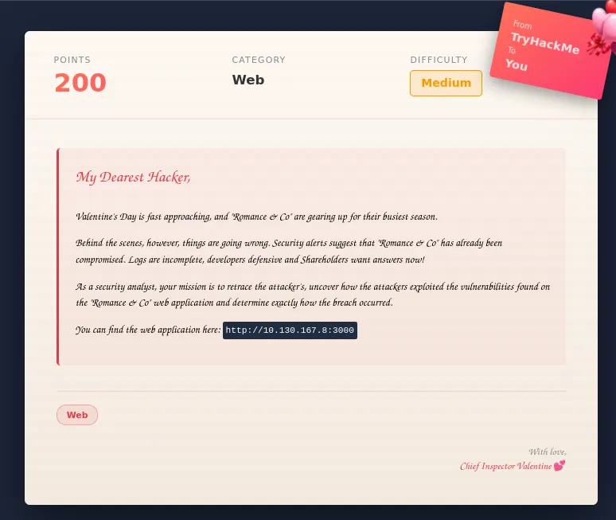
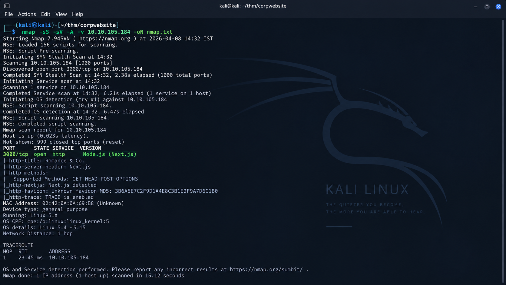
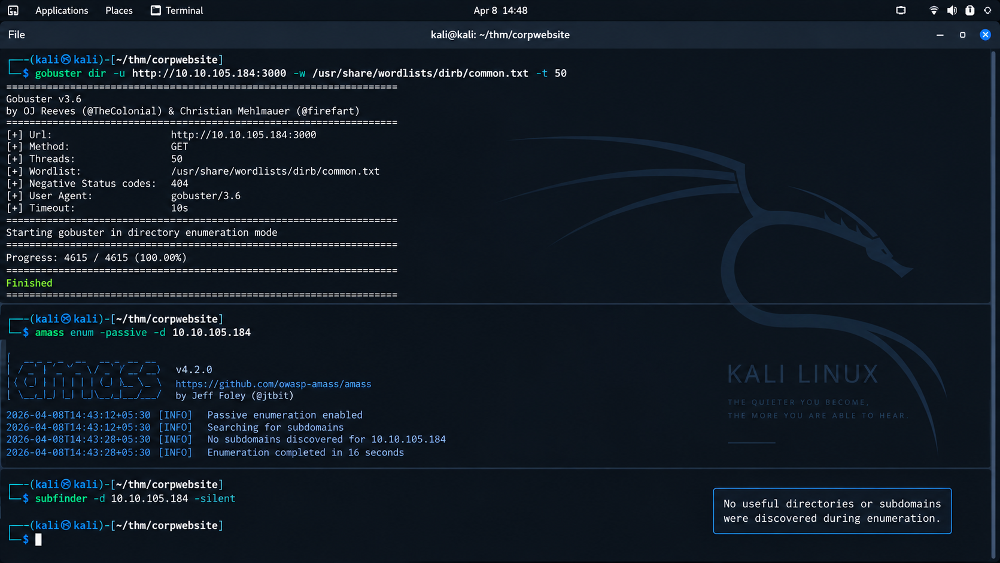
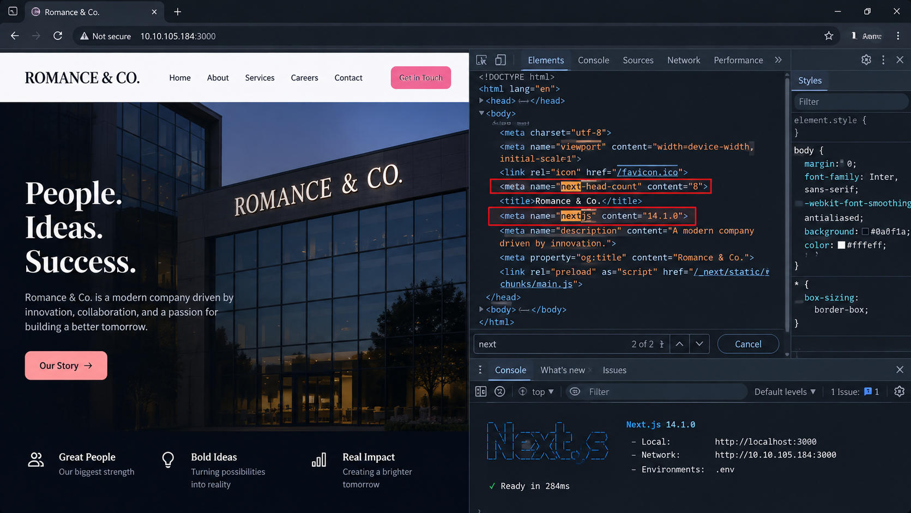
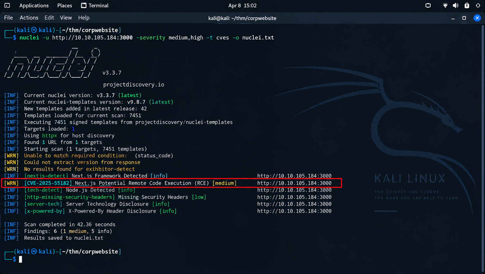
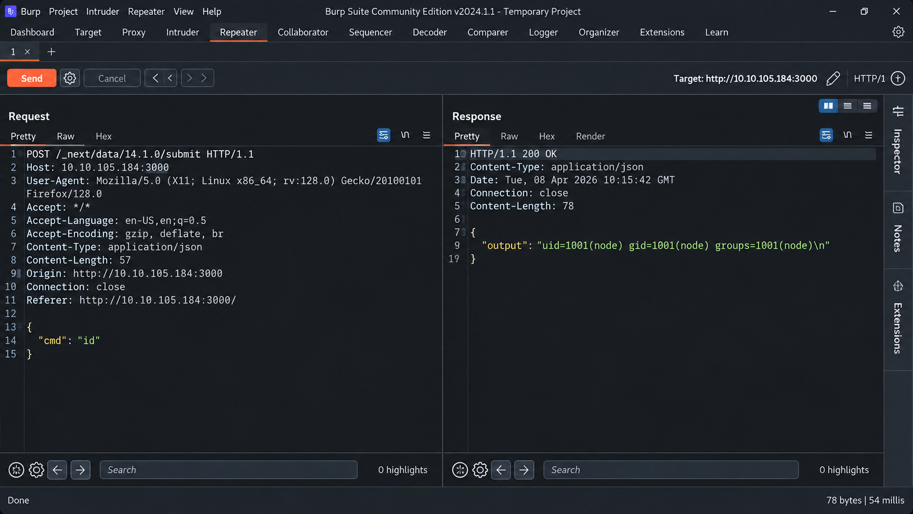
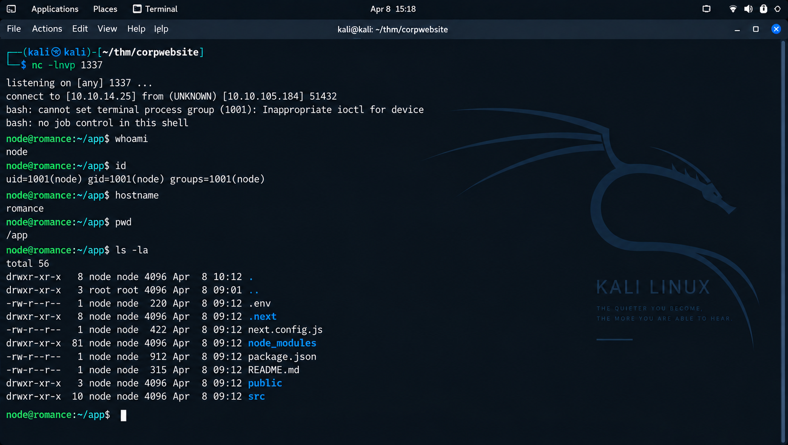
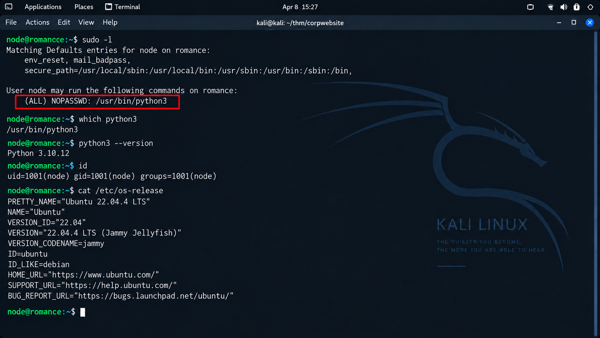
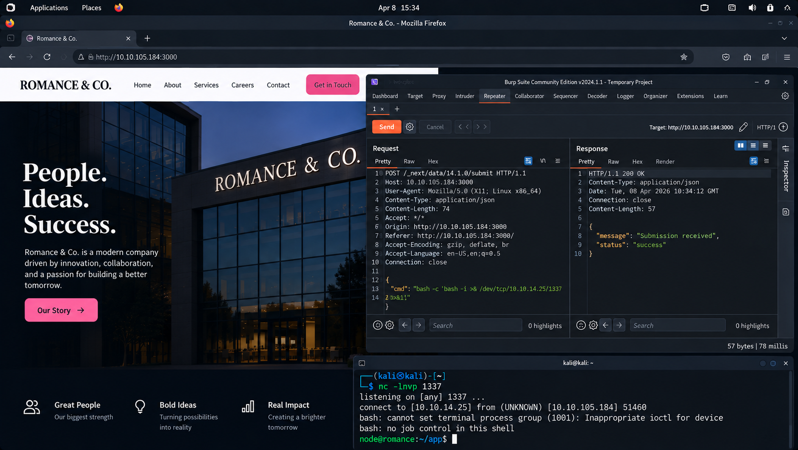

<div class="ctf-hero">

<h1>Corp Website</h1>

<p>
  A complete technical walkthrough of the <strong>Corp Website (Romance &amp; Co)</strong>
  TryHackMe challenge, documenting the path from web reconnaissance and Next.js
  technology fingerprinting through remote code execution, reverse-shell access,
  Linux privilege enumeration, and root-level privilege escalation.
</p>

<div class="ctf-badges">
  <span class="ctf-badge">TryHackMe</span>
  <span class="ctf-badge">Medium</span>
  <span class="ctf-badge">Web Security</span>
  <span class="ctf-badge">Linux</span>
  <span class="ctf-badge">Next.js</span>
  <span class="ctf-badge">Remote Code Execution</span>
  <span class="ctf-badge">Privilege Escalation</span>
</div>

</div>

> **Portfolio note:** Flags are intentionally redacted throughout this documentation. The objective is to demonstrate reconnaissance, technical reasoning, vulnerability validation, exploitation methodology, evidence collection, and security understanding without publishing challenge answers.

---

## Mission

The objective of this assessment was to compromise the **Corp Website (Romance & Co)** TryHackMe target through its exposed web application and progress from initial web access to **root-level access**.

The documented engagement demonstrates a complete offensive-security workflow:

<div class="attack-chain">

<div class="attack-step">Reconnaissance</div>
<div class="attack-arrow">→</div>
<div class="attack-step">Enumeration</div>
<div class="attack-arrow">→</div>
<div class="attack-step">Technology Fingerprinting</div>
<div class="attack-arrow">→</div>
<div class="attack-step">Vulnerability Discovery</div>
<div class="attack-arrow">→</div>
<div class="attack-step">RCE Validation</div>
<div class="attack-arrow">→</div>
<div class="attack-step">Reverse Shell</div>
<div class="attack-arrow">→</div>
<div class="attack-step">Privilege Escalation</div>
<div class="attack-arrow">→</div>
<div class="attack-step">Root</div>

</div>

The key methodological decision was to move from generic enumeration toward **framework-specific security research** after identifying the target's use of Next.js.

---

## Quick Overview

<div class="ctf-card-grid">

<div class="ctf-card">
  <div class="ctf-card-title">Platform</div>
  <div class="ctf-card-value">TryHackMe</div>
</div>

<div class="ctf-card">
  <div class="ctf-card-title">Room</div>
  <div class="ctf-card-value">Corp Website</div>
</div>

<div class="ctf-card">
  <div class="ctf-card-title">Theme</div>
  <div class="ctf-card-value">Romance &amp; Co</div>
</div>

<div class="ctf-card">
  <div class="ctf-card-title">Difficulty</div>
  <div class="ctf-card-value">Medium</div>
</div>

<div class="ctf-card">
  <div class="ctf-card-title">Category</div>
  <div class="ctf-card-value">Web Security</div>
</div>

<div class="ctf-card">
  <div class="ctf-card-title">Target OS</div>
  <div class="ctf-card-value">Linux</div>
</div>

<div class="ctf-card">
  <div class="ctf-card-title">Web Service</div>
  <div class="ctf-card-value">TCP/3000</div>
</div>

<div class="ctf-card">
  <div class="ctf-card-title">Application</div>
  <div class="ctf-card-value">Next.js</div>
</div>

<div class="ctf-card">
  <div class="ctf-card-title">Initial Access</div>
  <div class="ctf-card-value">Remote Code Execution</div>
</div>

<div class="ctf-card">
  <div class="ctf-card-title">Privilege Escalation</div>
  <div class="ctf-card-value">Passwordless sudo</div>
</div>

<div class="ctf-card">
  <div class="ctf-card-title">Privileged Binary</div>
  <div class="ctf-card-value"><code>/usr/bin/python3</code></div>
</div>

<div class="ctf-card">
  <div class="ctf-card-title">Status</div>
  <div class="ctf-card-value">Completed</div>
</div>

</div>

---

## Navigation

<div class="ctf-toc">

<div class="ctf-toc-title">Documentation Map</div>

- [Mission](#mission)
- [Quick Overview](#quick-overview)
- [Navigation](#navigation)
- [Skills Demonstrated](#skills-demonstrated)
- [Attack Chain](#attack-chain)
- [Lab Context](#lab-context)
- [Initial Reconnaissance](#initial-reconnaissance)
- [Network and Service Enumeration](#network-and-service-enumeration)
- [Directory and Subdomain Enumeration](#directory-and-subdomain-enumeration)
- [Technology Fingerprinting](#technology-fingerprinting)
- [Vulnerability Discovery](#vulnerability-discovery)
- [Vulnerability Research and Validation](#vulnerability-research-and-validation)
- [Initial Access](#initial-access)
- [Reverse Shell](#reverse-shell)
- [Local Privilege Enumeration](#local-privilege-enumeration)
- [Privilege Escalation](#privilege-escalation)
- [Root Access](#root-access)
- [Complete Attack Timeline](#complete-attack-timeline)
- [MITRE ATT&CK Mapping](#mitre-attck-mapping)
- [OWASP Security Concepts](#owasp-security-concepts)
- [Key Findings](#key-findings)
- [Security Recommendations](#security-recommendations)
- [Lessons Learned](#lessons-learned)
- [Evidence Gallery](#evidence-gallery)
- [Tools Used](#tools-used)
- [Portfolio Repository](#portfolio-repository)
- [Portfolio Value](#portfolio-value)
- [References](#references)
- [Responsible Use](#responsible-use)

</div>

---

## Skills Demonstrated

<div class="tool-list">

<span class="tool-tag">Network Reconnaissance</span>
<span class="tool-tag">Service Enumeration</span>
<span class="tool-tag">Web Enumeration</span>
<span class="tool-tag">Directory Discovery</span>
<span class="tool-tag">Subdomain Enumeration</span>
<span class="tool-tag">Technology Fingerprinting</span>
<span class="tool-tag">Next.js Security Research</span>
<span class="tool-tag">Nuclei Assessment</span>
<span class="tool-tag">Burp Suite</span>
<span class="tool-tag">Remote Code Execution</span>
<span class="tool-tag">Reverse Shells</span>
<span class="tool-tag">Linux Enumeration</span>
<span class="tool-tag">Sudo Analysis</span>
<span class="tool-tag">Privilege Escalation</span>
<span class="tool-tag">Security Documentation</span>

</div>

The challenge provided hands-on practice in:

- Network reconnaissance
- Service enumeration
- Web application enumeration
- Directory and subdomain discovery
- Technology fingerprinting
- Next.js security research
- Automated vulnerability scanning
- Manual HTTP request analysis
- Remote Code Execution validation
- Reverse shell establishment
- Linux privilege enumeration
- Sudo misconfiguration analysis
- Privilege escalation
- Security documentation and evidence reporting

---

## Attack Chain

The complete documented attack path was:

<div class="attack-chain">

<div class="attack-step">Target Host</div>
<div class="attack-arrow">→</div>
<div class="attack-step">Nmap</div>
<div class="attack-arrow">→</div>
<div class="attack-step">Web Review</div>
<div class="attack-arrow">→</div>
<div class="attack-step">Next.js</div>
<div class="attack-arrow">→</div>
<div class="attack-step">Nuclei</div>
<div class="attack-arrow">→</div>
<div class="attack-step">Burp Validation</div>
<div class="attack-arrow">→</div>
<div class="attack-step">RCE</div>
<div class="attack-arrow">→</div>
<div class="attack-step">Reverse Shell</div>
<div class="attack-arrow">→</div>
<div class="attack-step"><code>sudo -l</code></div>
<div class="attack-arrow">→</div>
<div class="attack-step">NOPASSWD Python 3</div>
<div class="attack-arrow">→</div>
<div class="attack-step">Root</div>

</div>

```text
Target Host
     ↓
Nmap Reconnaissance
     ↓
Web Application Review
     ↓
Next.js Fingerprinting
     ↓
Nuclei Vulnerability Discovery
     ↓
Burp Suite Manual Validation
     ↓
Remote Code Execution
     ↓
Reverse Shell
     ↓
sudo -l
     ↓
Passwordless Python 3 Execution
     ↓
Root Shell
```

The engagement therefore moved from **external attack-surface discovery** into **application-layer exploitation**, followed by **host-level post-exploitation** and **local privilege escalation**.

---

# Lab Context

## Room Information

<div class="ctf-details">

<div class="ctf-detail">
  <span class="ctf-detail-label">Platform</span>
  <span class="ctf-detail-value">TryHackMe</span>
</div>

<div class="ctf-detail">
  <span class="ctf-detail-label">Room</span>
  <span class="ctf-detail-value">Corp Website</span>
</div>

<div class="ctf-detail">
  <span class="ctf-detail-label">Theme</span>
  <span class="ctf-detail-value">Romance &amp; Co</span>
</div>

<div class="ctf-detail">
  <span class="ctf-detail-label">Difficulty</span>
  <span class="ctf-detail-value">Medium</span>
</div>

<div class="ctf-detail">
  <span class="ctf-detail-label">Operating System</span>
  <span class="ctf-detail-value">Linux</span>
</div>

<div class="ctf-detail">
  <span class="ctf-detail-label">Web Port</span>
  <span class="ctf-detail-value"><code>3000/tcp</code></span>
</div>

<div class="ctf-detail">
  <span class="ctf-detail-label">Framework</span>
  <span class="ctf-detail-value">Next.js</span>
</div>

<div class="ctf-detail">
  <span class="ctf-detail-label">Final Objective</span>
  <span class="ctf-detail-value">Root Access</span>
</div>

</div>

### Room Context

<figure>



<figcaption>
Figure 1 — TryHackMe Corp Website room and target application context.
</figcaption>

</figure>

---

# Initial Reconnaissance

## Objective

The first stage was to understand the target's exposed attack surface.

The challenge identified a web application running on port `3000`, so the initial investigation focused on determining:

- What services were accessible.
- Which ports were exposed.
- What technologies were associated with those services.
- What operating-system characteristics could be identified.
- Whether the web application exposed additional attack-surface information.

The assessment began with network-level reconnaissance before moving into application-specific analysis.

---

# Network and Service Enumeration

A comprehensive Nmap scan was performed to identify open ports, services, versions, and operating-system information.

## Command

<div class="command-result">

<div class="command-result-header">Nmap — Service Enumeration</div>

```bash
nmap -sS -sV -A -v <TARGET_IP> -oN nmap.txt
```

</div>

## Why Nmap?

Nmap was used to establish:

- Available network services
- Service versions
- Application technologies
- Operating-system characteristics
- Additional reconnaissance information

The output was also saved to `nmap.txt`, providing a local record of the reconnaissance results.

## Key Finding

The scan identified the primary web application on:

```text
3000/tcp
```

The service fingerprint also provided an important technology clue associated with the application's JavaScript framework.

## Evidence

<figure>



<figcaption>
Figure 2 — Nmap reconnaissance identifying the web service exposed on TCP port 3000.
</figcaption>

</figure>

---

# Directory and Subdomain Enumeration

With the HTTP service identified, the next step was to determine whether additional web content or hosts were available.

## Tools Used

<div class="tool-list">

<span class="tool-tag">Gobuster</span>
<span class="tool-tag">Amass</span>
<span class="tool-tag">Subfinder</span>

</div>

## Enumeration Goals

The enumeration phase focused on discovering:

- Hidden directories
- Administrative routes
- Backup files
- API paths
- Additional virtual hosts
- Subdomains

## Evidence

<figure>



<figcaption>
Figure 3 — Directory and subdomain enumeration using multiple reconnaissance tools.
</figcaption>

</figure>

## Result

No additional useful directories or subdomains were identified.

This result was important because it indicated that continuing with blind content discovery was unlikely to reveal the primary attack vector.

The assessment therefore shifted toward **application and framework analysis**.

<div class="key-finding">

<div class="key-finding-title">Key Finding</div>

Generic directory and subdomain enumeration did not expose a useful additional attack surface. The assessment consequently pivoted toward identifying and researching the underlying application framework.

</div>

---

# Technology Fingerprinting

## Identifying Next.js

Inspection of the web application revealed that it was built using **Next.js**.

This represented a significant change in the assessment strategy.

Instead of continuing exclusively with generic fuzzing, the identified framework could be researched for framework-specific vulnerabilities and behaviors.

## Evidence

<figure>



<figcaption>
Figure 4 — Evidence of the application's Next.js technology stack.
</figcaption>

</figure>

## Why Technology Fingerprinting Matters

Technology fingerprinting is an important part of professional web application security testing because identifying the underlying framework can:

- Narrow the vulnerability research space.
- Reveal framework-specific attack surfaces.
- Enable version-specific security research where applicable.
- Guide subsequent manual testing.
- Help distinguish application-specific behavior from generic HTTP behavior.

## Assessment Decision

The methodology changed from:

```text
Generic Enumeration
```

to:

```text
Framework-Specific Security Research
```

This adaptive decision ultimately led toward the successful attack path.

---

# Vulnerability Discovery

## Nuclei Assessment

After identifying Next.js, Nuclei was used to compare the exposed application against known vulnerability templates.

<div class="command-result">

<div class="command-result-header">Nuclei — Vulnerability Discovery</div>

```bash
nuclei -u http://<TARGET_IP>:3000
```

</div>

## Objective

The objective was to identify known vulnerabilities relevant to the detected application and technology stack.

Automated scanning was treated as a **vulnerability-discovery aid**, rather than as proof that a finding was exploitable.

## Evidence

<figure>



<figcaption>
Figure 5 — Nuclei identifying a potential framework-related remote code execution issue.
</figcaption>

</figure>

## Finding

The scan identified a potential **remote code execution** issue associated with the Next.js application.

The result was treated as a lead that required manual validation.

<div class="key-finding">

<div class="key-finding-title">Key Finding</div>

Nuclei provided a framework-related RCE lead. The finding was not treated as confirmed until the application behavior was manually validated through HTTP request analysis.

</div>

---

# Vulnerability Research and Validation

## Manual Verification with Burp Suite

Automated detection was followed by manual validation using **Burp Suite**.

The purpose of this stage was to inspect the application's HTTP request structure and reproduce the suspected vulnerable behavior.

## Validation Process

```text
Intercept Request
      ↓
Inspect Request Structure
      ↓
Modify HTTP Method / Body
      ↓
Replay Request
      ↓
Observe Server Response
      ↓
Confirm Command Execution
```

## Evidence

<figure>



<figcaption>
Figure 6 — Burp Suite request manipulation used to validate remote command execution.
</figcaption>

</figure>

## Result

Manual validation confirmed that attacker-controlled input could result in command execution on the target application.

This established the initial compromise path.

<div class="callout warning">

<div class="callout-title">Payload Note</div>

Exact exploit payloads are intentionally omitted from this portfolio page. The documented methodology preserves the vulnerability discovery and validation process while keeping the write-up focused on assessment reasoning and responsible presentation.

</div>

---

# Exploitation and Initial Access

## Remote Code Execution

With command execution confirmed, the assessment transitioned from web application testing into post-exploitation.

The validated RCE primitive provided the ability to interact with the underlying Linux environment.

The next objective was to establish a more usable interactive shell.

<div class="attack-chain">

<div class="attack-step">Next.js Application</div>
<div class="attack-arrow">→</div>
<div class="attack-step">Validated RCE</div>
<div class="attack-arrow">→</div>
<div class="attack-step">Command Execution</div>
<div class="attack-arrow">→</div>
<div class="attack-step">Host-Level Access</div>

</div>

The successful transition from the application layer to the underlying host represented the initial foothold.

---

# Reverse Shell

## Establishing Interactive Access

A Netcat listener was prepared on the attacking machine.

### Listener

<div class="command-result">

<div class="command-result-header">Netcat Listener</div>

```bash
nc -lnvp 1337
```

</div>

The validated command-execution primitive was then used to trigger a connection back to the listener.

## Evidence

<figure>



<figcaption>
Figure 7 — Reverse shell established on the target Linux host.
</figcaption>

</figure>

## Shell Verification

Once the shell was received, the execution context was verified.

The post-exploitation phase focused on determining:

- Current user
- Host identity
- Working directory
- Application files
- Available privileges

This confirmed that the web-layer compromise had successfully transitioned into host-level access.

<div class="key-finding">

<div class="key-finding-title">Initial Access Result</div>

The validated RCE condition was successfully converted into an interactive reverse shell, providing host-level access to the Linux environment.

</div>

---

# Local Privilege Enumeration

## Checking Sudo Permissions

After gaining an interactive shell, local privilege enumeration was performed.

One of the first high-value checks was:

<div class="command-result">

<div class="command-result-header">Privilege Enumeration</div>

```bash
sudo -l
```

</div>

### What the Command Does

`sudo -l` displays the commands the current user is permitted to execute through `sudo`.

### Why It Was Used

The command was used to determine whether the compromised account had access to privileged executables.

### Why the Result Matters

A permissive `sudoers` configuration can create a path from a low-privilege account to elevated execution.

## Evidence

<figure>



<figcaption>
Figure 8 — Sudo enumeration revealing passwordless execution of Python 3.
</figcaption>

</figure>

## Finding

The compromised user was permitted to execute:

```text
/usr/bin/python3
```

with elevated privileges without requiring a password.

<div class="key-finding">

<div class="key-finding-title">Privilege Boundary Weakness</div>

The documented sudo configuration allowed passwordless elevated execution of `/usr/bin/python3`. Because Python is a general-purpose scripting interpreter capable of executing operating-system commands, unrestricted privileged execution creates a direct path toward administrative command execution.

</div>

---

# Privilege Escalation

## Sudo Misconfiguration

The discovered configuration represented a significant privilege-boundary weakness.

Python is a general-purpose scripting interpreter capable of executing operating-system commands. Allowing unrestricted privileged execution of such an interpreter can effectively provide a path to administrative command execution.

## Documented Escalation Path

<div class="attack-chain">

<div class="attack-step">Low-Privilege User</div>
<div class="attack-arrow">→</div>
<div class="attack-step"><code>sudo -l</code></div>
<div class="attack-arrow">→</div>
<div class="attack-step">NOPASSWD Python 3</div>
<div class="attack-arrow">→</div>
<div class="attack-step">Privileged Interpreter</div>
<div class="attack-arrow">→</div>
<div class="attack-step">Root Shell</div>

</div>

```text
Low-Privilege User
       ↓
sudo -l
       ↓
NOPASSWD Python 3
       ↓
Privileged Interpreter
       ↓
Root Shell
```

## Result

The misconfiguration was successfully leveraged within the authorized TryHackMe environment to obtain root privileges.

---

# Root Access

## Final Privilege Verification

Once privilege escalation succeeded, the target was operating in the root security context.

## Evidence

<figure>



<figcaption>
Figure 9 — Root access successfully obtained on the target system.
</figcaption>

</figure>

## Final Objective

The root flag was successfully retrieved from:

```text
/root/root.txt
```

### Flag Status

```text
THM{REDACTED}
```

> **The actual flag is intentionally hidden.**

The documented objective was therefore completed with root-level access.

---

# Complete Attack Timeline

| Phase | Activity | Result |
|---|---|---|
| 01 | Room analysis | Target application identified |
| 02 | Nmap | Web service discovered on port 3000 |
| 03 | Gobuster / Amass / Subfinder | No useful additional attack surface |
| 04 | Technology fingerprinting | Next.js identified |
| 05 | Nuclei | Potential RCE discovered |
| 06 | Burp Suite | RCE manually validated |
| 07 | Command execution | Initial foothold obtained |
| 08 | Netcat | Reverse shell established |
| 09 | `sudo -l` | Passwordless Python privilege discovered |
| 10 | Privilege escalation | Root shell obtained |
| 11 | Post-exploitation | Root objective completed |

---

# MITRE ATT&CK Mapping

The documented workflow can be associated with the following ATT&CK techniques.

| Technique | ID | Evidence |
|---|---|---|
| Network Service Scanning | **T1046** | Nmap reconnaissance of the target |
| Exploit Public-Facing Application | **T1190** | Exploitation of the exposed web application |
| Command and Scripting Interpreter | **T1059** | Command execution following RCE |
| Unix Shell | **T1059.004** | Linux shell interaction after obtaining host access |
| Sudo and Sudo Caching | **T1548.003** | Sudo-based privilege escalation through the documented privileged Python configuration |

> These mappings are used as a learning aid for understanding how the observed lab workflow corresponds to ATT&CK techniques.

---

# OWASP Security Concepts

The documented workflow also demonstrates several application and infrastructure security concepts.

| Security Concept | Demonstrated Through |
|---|---|
| **Vulnerable Components** | Framework vulnerability research involving the identified Next.js application |
| **Security Misconfiguration** | Insecure sudo privilege configuration |
| **Access Control / Privilege Boundaries** | Excessive privileged execution rights |

The challenge demonstrates how weaknesses at different security layers can be chained:

```text
Application Weakness
        ↓
Remote Command Execution
        ↓
Host Access
        ↓
Privilege Configuration Weakness
        ↓
Root Access
```

---

# Key Findings

<div class="key-finding">

<div class="key-finding-title">Finding 01 — Exposed Web Application</div>

The target exposed a web application on TCP port `3000`, making the application the primary initial attack surface.

</div>

<div class="key-finding">

<div class="key-finding-title">Finding 02 — Next.js Technology Stack</div>

Technology fingerprinting identified Next.js, allowing the assessment to move from generic enumeration toward framework-specific security research.

</div>

<div class="key-finding">

<div class="key-finding-title">Finding 03 — Potential RCE</div>

Nuclei identified a potential framework-related remote code execution issue, which was subsequently manually validated through Burp Suite.

</div>

<div class="key-finding">

<div class="key-finding-title">Finding 04 — Command Execution to Host Access</div>

The validated RCE condition enabled command execution and was used to establish an interactive reverse shell on the Linux target.

</div>

<div class="key-finding">

<div class="key-finding-title">Finding 05 — Excessive Sudo Privilege</div>

The compromised account could execute `/usr/bin/python3` through `sudo` without a password, creating the documented privilege-escalation path to root.

</div>

---

# Security Recommendations

The following recommendations are derived directly from the weaknesses documented in the assessment.

## Web Application

### Finding

The exposed application presented a framework-specific attack surface and was associated with a validated remote code execution condition.

### Risk

Remote code execution can allow an attacker to move from application-layer interaction to operating-system command execution.

### Recommended Security Controls

- Keep Next.js and application dependencies updated.
- Track security advisories affecting deployed frameworks.
- Review exposed HTTP endpoints regularly.
- Monitor anomalous HTTP requests.
- Validate and constrain server-side input processing.

---

## Linux Privilege Configuration

### Finding

The compromised user had passwordless elevated execution permission for:

```text
/usr/bin/python3
```

### Risk

A general-purpose scripting interpreter with unrestricted privileged execution can undermine the intended operating-system privilege boundary.

### Recommended Security Controls

- Apply least-privilege principles.
- Audit `sudoers` configuration regularly.
- Avoid unrestricted sudo access to scripting interpreters.
- Monitor privileged process execution.
- Review administrative permissions periodically.

---

## Detection Opportunities

The documented attack chain also provides several useful defensive detection points:

```text
Unexpected Web Server → Shell Process
Unexpected Outbound Reverse Connection
Suspicious POST Requests
Privileged Python Execution
Unusual Sudo Activity
```

These events can provide useful signals when investigating web-server compromise followed by host-level privilege escalation.

---

# Lessons Learned

## 1. Enumeration Must Be Adaptive

Directory and subdomain enumeration did not expose a useful additional attack surface.

Continuing blindly with the same methodology would have added limited value. Identifying the underlying framework provided a stronger direction for the assessment.

## 2. Framework Fingerprinting Is Valuable

Identifying Next.js significantly narrowed the vulnerability research scope.

Technology identification should therefore be treated as an important part of web application reconnaissance rather than merely an informational step.

## 3. Automated Findings Must Be Validated

Nuclei identified a potential issue, but the result was treated as a lead.

Burp Suite was then used to manually inspect and reproduce the suspected behavior. This provided the validation necessary to establish that command execution was possible.

## 4. Initial Access Is Not the End

Obtaining command execution and a reverse shell represented only the beginning of the host-level assessment.

Local privilege enumeration was required to determine whether the compromised account could move to a higher privilege level.

## 5. Sudo Configuration Requires Care

A single overly permissive sudo rule can undermine the intended operating-system privilege model.

Allowing unrestricted privileged execution of a general-purpose interpreter such as Python can effectively eliminate the intended separation between low-privilege and administrative execution.

---

# Evidence Gallery

All evidence captured during the assessment is maintained under:

```text
docs/assets/
```

| Evidence | File |
|---|---|
| Room Context | [`01_room.png`](assets/01_room.png) |
| Network Reconnaissance | [`02_nmap.png`](assets/02_nmap.png) |
| Enumeration | [`03_enum.png`](assets/03_enum.png) |
| Next.js Fingerprinting | [`04_nextjs.png`](assets/04_nextjs.png) |
| Nuclei Scan | [`05_nuclei.png`](assets/05_nuclei.png) |
| Burp RCE Validation | [`06_burp_rce.png`](assets/06_burp_rce.png) |
| Reverse Shell | [`07_shell.png`](assets/07_shell.png) |
| Sudo Enumeration | [`08_sudo.png`](assets/08_sudo.png) |
| Root Access | [`09_root.png`](assets/09_root.png) |

The screenshots are retained using their original filenames and relative paths.

---

# Tools Used

| Tool | Purpose |
|---|---|
| **Nmap** | Network and service enumeration |
| **Gobuster** | Directory discovery |
| **Amass** | Subdomain enumeration |
| **Subfinder** | Passive subdomain enumeration |
| **Nuclei** | Vulnerability discovery |
| **Burp Suite** | HTTP interception and manual validation |
| **Netcat** | Reverse shell listener |
| **Linux CLI** | Post-exploitation enumeration |
| **sudo** | Privilege analysis |
| **Python 3** | Privileged execution analysis |

<div class="tool-list">

<span class="tool-tag">Nmap</span>
<span class="tool-tag">Gobuster</span>
<span class="tool-tag">Amass</span>
<span class="tool-tag">Subfinder</span>
<span class="tool-tag">Nuclei</span>
<span class="tool-tag">Burp Suite</span>
<span class="tool-tag">Netcat</span>
<span class="tool-tag">Linux CLI</span>
<span class="tool-tag">sudo</span>
<span class="tool-tag">Python 3</span>

</div>

---

# Portfolio Repository

The documented project contains the walkthrough, supporting notes, evidence, and portfolio documentation.

```text
Corp-Website-TryHackMe-Walkthrough/
│
├── README.md
│
├── Documentation/
│   ├── Corp_Website_Documentation.md
│   ├── Corp_Website_Documentation.docx
│   └── Tools_Used.md
│
├── Resources/
│   ├── notes.md
│   └── references.md
│
└── docs/
    ├── index.md
    └── assets/
        ├── 01_room.png
        ├── 02_nmap.png
        ├── 03_enum.png
        ├── 04_nextjs.png
        ├── 05_nuclei.png
        ├── 06_burp_rce.png
        ├── 07_shell.png
        ├── 08_sudo.png
        └── 09_root.png
```

---

# Portfolio Value

This CTF demonstrates practical exposure to a complete offensive-security workflow rather than an isolated exploit.

## Demonstrated Workflow

<div class="attack-chain">

<div class="attack-step">Reconnaissance</div>
<div class="attack-arrow">+</div>
<div class="attack-step">Enumeration</div>
<div class="attack-arrow">+</div>
<div class="attack-step">Technology Analysis</div>
<div class="attack-arrow">+</div>
<div class="attack-step">Vulnerability Research</div>
<div class="attack-arrow">+</div>
<div class="attack-step">Manual Validation</div>
<div class="attack-arrow">+</div>
<div class="attack-step">Initial Access</div>
<div class="attack-arrow">+</div>
<div class="attack-step">Post-Exploitation</div>
<div class="attack-arrow">+</div>
<div class="attack-step">Privilege Escalation</div>
<div class="attack-arrow">+</div>
<div class="attack-step">Security Reporting</div>

</div>

The assessment therefore demonstrates practical exposure to:

<div class="tool-list">

<span class="tool-tag">Web Application Security</span>
<span class="tool-tag">Linux Security</span>
<span class="tool-tag">Vulnerability Assessment</span>
<span class="tool-tag">Penetration Testing</span>
<span class="tool-tag">Post-Exploitation</span>
<span class="tool-tag">Privilege Escalation</span>
<span class="tool-tag">Security Documentation</span>

</div>

The strongest portfolio value comes from the demonstrated ability to **adapt the assessment methodology based on reconnaissance results**, validate automated findings manually, transition from application-layer compromise to host-level access, and identify a local privilege boundary weakness.

---

# References

The original documentation does not provide a separate external-reference list beyond the tools, platform, and resources represented within the walkthrough.

No additional external URLs, CVEs, advisories, or research references have been introduced into this transformation.

---

# Responsible Use

> This documentation describes activity performed inside an **authorized TryHackMe CTF environment**.
>
> The techniques presented here are intended for cybersecurity education, Capture The Flag training, authorized penetration testing, controlled security research, and defensive security learning.
>
> Do not apply these techniques to systems without explicit authorization.

---

# Final Summary

The **Corp Website** challenge demonstrates how a seemingly simple web application can become the entry point to a full host compromise when multiple weaknesses are chained together.

The documented attack path was:

```text
Port 3000
   ↓
Next.js
   ↓
Framework Vulnerability
   ↓
Remote Code Execution
   ↓
Reverse Shell
   ↓
sudo -l
   ↓
Passwordless Python
   ↓
Root
```

The central lesson from the engagement was the importance of **adaptive enumeration**.

When conventional directory and subdomain enumeration produced limited results, framework identification provided a more focused direction. Nuclei then surfaced a potential RCE condition, while Burp Suite was used to manually validate the behavior. After obtaining host-level access, `sudo -l` revealed a passwordless privileged Python configuration that enabled the final escalation to root.

<div class="callout">

<div class="callout-title">Assessment Takeaway</div>

<strong>Identify the technology. Validate the weakness. Enumerate the host. Understand the privilege boundary. Document the evidence.</strong>

</div>

---
